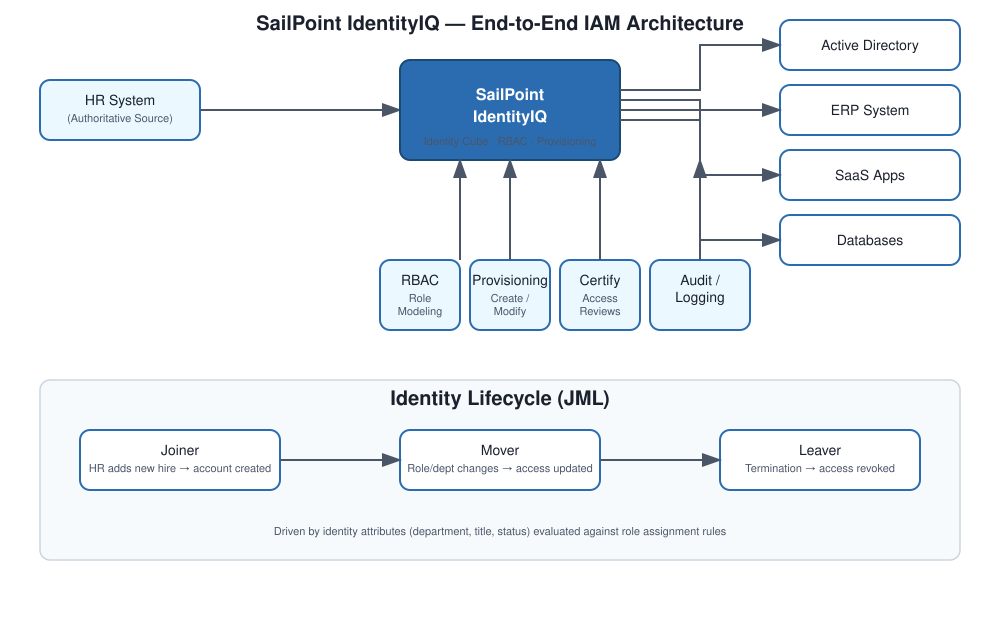

# IAM Architecture Overview

This is the end-to-end picture I keep in my head whenever I'm explaining how a SailPoint IdentityIQ implementation fits together — useful both as documentation and as the answer I give when an interviewer asks me to "draw the architecture on the whiteboard."

## The business problem

Most mid-to-large enterprises end up with the same mess: an HR system, Active Directory, an ERP, a handful of SaaS apps, and a few databases — each with its own idea of who a user is and what they're allowed to touch. Nobody owns the full picture. Access gets granted by email request, nobody remembers to revoke it, and when an audit comes around someone spends three weeks pulling spreadsheets together. That's the gap IdentityIQ is built to close: one place to see who has access to what, why they have it, and a way to act on that automatically instead of manually.

## The high-level shape

At the center sits IdentityIQ, with the HR system feeding it as the authoritative source of identity truth. From there it reaches out to target applications — AD, ERP, SaaS, databases — through connectors, and a few supporting layers do the heavy lifting underneath: RBAC for modeling access, a provisioning engine for acting on it, a certification engine for reviewing it, and logging/audit underneath all of it.

## How a user actually moves through the system

1. **Identity creation (the Joiner side of JML).** HR sends over employee data, and IdentityIQ either creates a new identity cube or updates an existing one.
2. **Application onboarding.** Each target system gets connected via a connector — JDBC, LDAP, REST, whatever fits — and its accounts/entitlements get pulled in.
3. **Correlation.** Accounts from those applications get matched back to identities, usually on something stable like employee ID or email.
4. **Access modeling.** Entitlements get grouped into roles that actually mean something to the business (not just "READ_DB_042").
5. **Provisioning.** A provisioning plan gets generated and executed — accounts get created, modified, or disabled in the target systems.
6. **Access requests.** Users who need something outside their automatic role set can request it, and it routes through an approval workflow.
7. **Lifecycle events.** Joiners get access, movers get their access updated, leavers get it pulled — ideally same day, not three weeks later.
8. **Certifications.** Periodically, managers or app owners review who has what and decide what stays and what goes.
9. **Remediation.** Whatever gets revoked in a certification turns into an actual provisioning action, not just a checkbox.
10. **Monitoring and troubleshooting.** Task results, logs, and identity debug pages are how you actually keep this running day to day.

## Decisions I'd defend in an interview

- **HR as the single authoritative source.** Everything downstream depends on this being clean. If HR data is messy, the whole system inherits that mess.
- **RBAC over direct entitlement assignment.** It doesn't scale to assign individual entitlements to thousands of users one at a time — roles are the abstraction that makes governance possible.
- **Automating the JML lifecycle rather than relying on tickets.** Manual processes are where security gaps and audit findings come from.
- **Certifications as a recurring control, not a one-time event.** Compliance frameworks like SOX and GDPR expect ongoing evidence, not a snapshot.
- **Connectors as the integration layer**, so each new application follows the same onboarding pattern instead of a bespoke one-off.

## What this buys the business

- **Security** — least privilege gets enforced and orphaned accounts stop piling up.
- **Automation** — IT stops being the bottleneck for every access change.
- **Compliance** — audit evidence (who approved what, and when) is just there, not something you scramble to produce.
- **Scale** — the same model works whether you're onboarding your fifth application or your fiftieth.

## If someone asks me to explain this out loud

"I'd design a centralized IAM architecture around IdentityIQ, with the HR system as the authoritative source. Identity data gets aggregated and correlated, access gets modeled through RBAC, and provisioning runs automatically against target systems. Certifications keep access honest over time, and when something breaks, logs and task results are where I'd go first to find out why."

## A note on scope

This is the conceptual layer — the individual modules (JML, onboarding, certifications, troubleshooting) go into the actual implementation details. I kept this one high-level on purpose, because in real interviews this is usually the first 90 seconds before someone asks a follow-up that drags you into the weeds.
