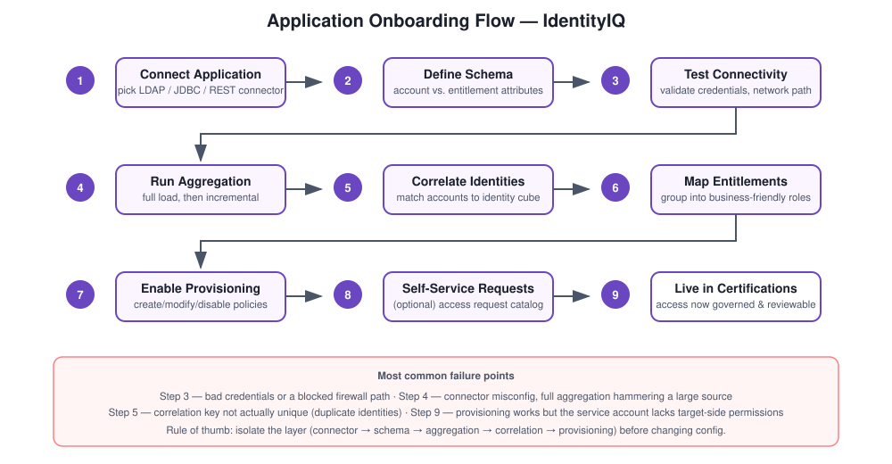

# IdentityIQ – Application Onboarding

## The problem this solves

Picture a company running AD for the network, an ERP for finance, a couple of SaaS tools, and a homegrown database app nobody wants to touch. Today, access to each one gets handled differently — a help desk ticket here, a direct DB insert there, an email to the app owner somewhere else. There's no single place that can answer "what does this person actually have access to across all of it?" Onboarding an application into IdentityIQ is how you fix that, one system at a time.

## How I approach it

Every application I onboard goes through roughly the same sequence, regardless of what it is underneath:

1. Connect it using the right connector type for what it actually is (LDAP, JDBC, REST, flat file, whatever fits).
2. Define the schema — what an account looks like, what an entitlement looks like.
3. Aggregate the data in so IdentityIQ actually has a copy of accounts and entitlements.
4. Correlate those accounts back to identities.
5. Model the entitlements into roles that make sense to a human, not just to the application.
6. Turn on provisioning and, where it makes sense, self-service access requests.
7. Hand it off to certification campaigns so access on this app gets reviewed going forward.

## Concepts that come up constantly

Application definitions, connectors (JDBC/REST/LDAP), account and entitlement schema, aggregation, correlation, RBAC, and provisioning policies. If you only remember one thing from this section, it's that schema design and correlation logic are where 90% of onboarding problems actually originate — not the connector itself.

## What usually goes wrong

- **Aggregation fails** — almost always a connector or credential issue, sometimes a network/firewall problem between IdentityIQ and the target.
- **Correlation doesn't match accounts to the right identity** — usually an attribute mismatch, like the unique key not actually being unique, or being blank for a chunk of accounts.
- **Provisioning fails after everything else looks fine** — usually a misconfigured policy or a permission the service account doesn't actually have on the target side.

## What I'd say if asked to explain this in an interview

"Onboarding an application into IdentityIQ means connecting it through the right connector, defining how its accounts and entitlements are structured, aggregating that data in, correlating it to existing identities, and then modeling the access into roles so it can be provisioned and governed going forward."

## Files in this folder

- `Application-Overview.md` — why onboarding matters and the conceptual approach
- `Schema-Design.md` — structuring account vs. entitlement data
- `Aggregation-Process.md` — how IdentityIQ actually pulls the data in
- `Entitlement-Mapping.md` — turning raw permissions into business-friendly roles
- `Troubleshooting.md` — what breaks and how I'd go about fixing it
