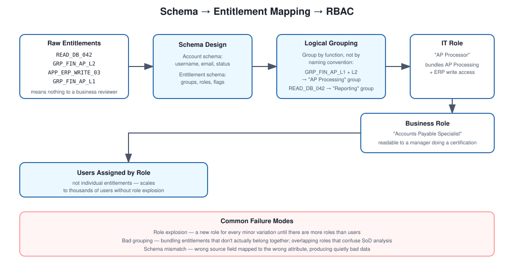

# Schema Design

## What this is actually about

Every application stores its own version of "a user" and "a permission," and none of them agree with each other. One system calls it a username, another calls it a login ID, a third buries it three levels deep in a nested API response. Schema design in IdentityIQ is the work of mapping all of that into something consistent the platform can actually reason about.

## How I think about it

The first split that matters is account schema vs. entitlement schema — they're not the same thing and shouldn't be modeled as if they were. Account schema describes the user record itself (username, email, status, manager). Entitlement schema describes what that account can do (group memberships, roles, permission flags). Get this distinction wrong early and you end up fighting it for the rest of the project.

## Concepts

Account schema, entitlement schema, attributes, and identity mapping. The identity attribute specifically — whatever field you pick to correlate an account back to a real person — deserves more attention than it usually gets.

## Steps I follow

1. Identify the core account attributes — username, email, whatever's actually present and reliable.
2. Define what counts as an entitlement for this system — could be AD groups, could be application roles, could be a flag buried in a custom table.
3. Map source attributes to IdentityIQ's internal schema fields.
4. Pick and set the identity attribute that correlation will rely on.
5. Run a test aggregation and actually validate the data came across the way you expected, not just that the job completed without errors.

## Where it goes wrong

- **Missing attributes** — the source system just doesn't expose something you need, and you have to find another way to derive it.
- **Bad mapping** — easy to mismap a field, especially when source field names are vague or inconsistently cased.
- **Multi-valued attributes** — group memberships in particular tend to come back as lists, and if the schema isn't configured to expect that, you get truncated or malformed data without an obvious error.

## How I'd explain it in an interview

"Account schema and entitlement schema serve different purposes, and IdentityIQ needs both defined clearly to do anything useful with the data. Getting attribute mapping right — especially the identity attribute used for correlation — is what determines whether the rest of the integration actually works."
