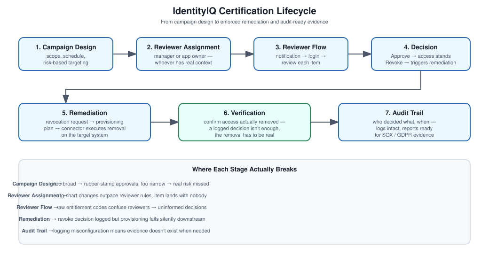

# IdentityIQ – Access Certifications

## The problem certifications solve

Access tends to accumulate quietly. Someone gets temporary access for a project, the project ends, nobody remembers to remove it. A year later that person has access to a dozen systems they no longer touch, and an auditor is now asking why. Certifications are the recurring control that catches this before it becomes a finding.

## My approach

A certification campaign is really just: pick what needs reviewing, find the right person to review it, give them a clear decision to make (keep or revoke), and then actually enforce whatever they decide. The "actually enforce" part is where a lot of implementations quietly fail — a revoke decision that doesn't turn into a real provisioning action isn't governance, it's just paperwork.

## Concepts

Certification campaigns, reviewers (manager or application owner), access reviews, revocation requests, remediation, audit logs, and SoD policies.

## How a campaign runs

1. Create the certification campaign.
2. Define its scope — which users, applications, or roles are actually in play.
3. Assign reviewers.
4. Launch it.
5. Reviewers go through and approve or revoke each item.
6. Revocations trigger remediation — actual provisioning actions, not just status flags.
7. Track completion and keep the audit trail intact.

## What tends to go sideways

- **Reviewer not assigned correctly** — usually a configuration gap, especially when org structure changes (a manager leaves and nobody updates the campaign rules).
- **Campaigns dragging on past their deadline** — often a notification or workflow issue, sometimes just reviewer fatigue from too many items.
- **Revocation decisions that never actually get enforced** — a provisioning failure downstream that nobody noticed because the certification UI showed the decision as "complete."

## If asked to explain this

"Certifications make sure access gets reviewed by the people who actually understand whether it's still needed — usually a manager or app owner. When something gets revoked, that decision needs to flow straight into a provisioning action, or the certification was just theater."

## Files here

- `Campaign-Design.md` — how to scope and schedule a campaign that reviewers can actually get through
- `Reviewer-Flow.md` — what the reviewer experience actually looks like
- `Remediation-Process.md` — turning a revoke decision into real access removal
- `Audit-Considerations.md` — what auditors actually want to see
