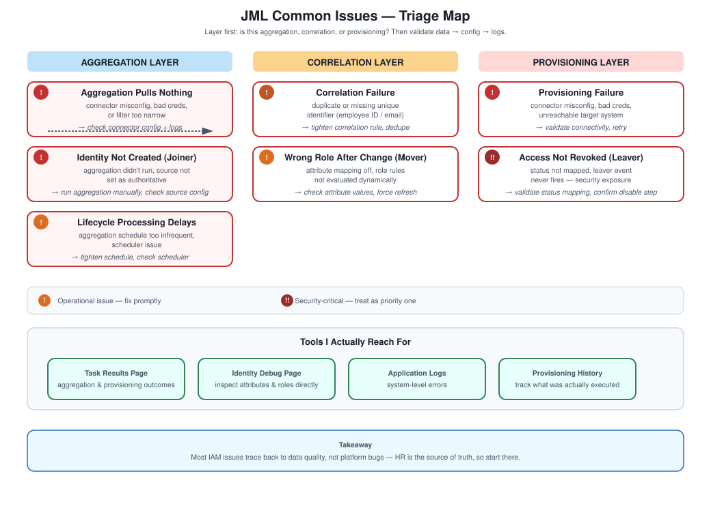

# JML Lifecycle — Common Issues & Troubleshooting

## Why I keep this list

Even a well-designed JML implementation runs into real problems — bad HR data, configuration drift, integration hiccups, timing issues. This is the running list I'd actually use when something's not working, organized the way I'd actually triage it rather than as an abstract taxonomy.

## How I approach troubleshooting here

Figure out whether the issue is in aggregation, correlation, or provisioning. Validate the HR input data itself. Check IdentityIQ's configuration against what you'd expect. Review logs and task results. Reproduce it, then fix it. The principle underneath all of it: almost every issue traces back to data, logic, or an integration point — rarely something mysterious in the platform itself.

## Concepts that come up

Aggregation tasks, the identity cube, correlation rules, provisioning plans, lifecycle events, workflows, logs (I lean on the application server logs alongside task results), and task results in the UI.

## Issue 1 — Identity not created (joiner failure)

A new employee just isn't showing up in IdentityIQ. Usually the aggregation task hasn't actually run, the HR source isn't configured as authoritative, or the data's simply missing from the HR feed itself. I'd run the aggregation manually, check the HR connector config, and validate the incoming file or API response directly rather than trusting the UI summary.

## Issue 2 — Wrong role after a role change (mover issue)

Someone keeps their old access after a role change, or doesn't get the new access they should have. Usually attribute mapping is off, the role assignment rules aren't actually dynamic, or the attribute change never got picked up. I'd check the actual attribute values, review the role rule logic, and force an identity refresh to see if it resolves on its own.

## Issue 3 — Access not revoked (leaver — this one's serious)

A terminated employee still has active accounts somewhere. This is the issue I take most seriously, because the security exposure is real, not theoretical. Usually the status field isn't mapped correctly, the leaver lifecycle event simply isn't triggering, or the disable/delete logic was never configured for a given application. I'd validate the status mapping carefully, check the lifecycle event configuration, and confirm provisioning policies actually include a disable step.

## Issue 4 — Provisioning failure

Access just doesn't get created or updated in the target system. Connector misconfiguration, an unreachable target, bad credentials, or an API failure are the usual suspects. I'd check connector settings, validate connectivity to the endpoint directly, review provisioning logs, and retry once the underlying issue is fixed.

## Issue 5 — Identity correlation failure

Duplicate identities, or accounts linked to the wrong person. Usually a missing unique identifier (employee ID or email) or a correlation rule that's not tight enough. I'd tighten the correlation logic, make sure the unique attribute is consistent across the source, and clean up duplicates that already exist.

## Issue 6 — Aggregation pulling nothing

No accounts or entitlements come back at all. Connector misconfiguration, a query or filter scoped too narrowly, or a permissions issue on the service account. I'd validate the connector config, test the connection manually outside IdentityIQ if possible, and review the aggregation logs line by line.

## Issue 7 — Lifecycle processing delays

Access changes aren't happening on time even though everything's technically configured. Usually an aggregation schedule that's too infrequent, or a task scheduler issue. I'd adjust the aggregation frequency and check the scheduler configuration directly.

## Tools I actually reach for

The task results page for aggregation and provisioning outcomes, the identity debug page to inspect attributes and roles directly, application logs for system-level errors, and provisioning transaction history to track exactly what got executed.

## Interview answer

"I troubleshoot in layers — first figure out whether it's aggregation, correlation, or provisioning, then validate the source HR data, check identity attributes, and review role assignment logic before diving into provisioning plans and logs. Most issues come back to data quality more often than people expect."

## The honest takeaway

Most IAM issues really are data problems, not platform bugs. HR is the source of truth, so when something looks wrong downstream, that's usually where I'd start looking before assuming IdentityIQ itself is misbehaving.
