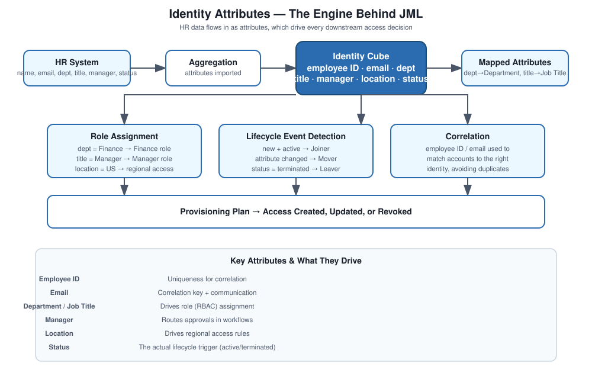

# JML Lifecycle — Identity Attributes

## Why attributes matter this much

Everything in JML — role assignment, lifecycle event detection, provisioning — ultimately runs off a handful of identity attributes. If those attributes are wrong or missing, every downstream decision built on top of them is wrong too. I think of attributes as the inputs to the whole decision engine, not just metadata sitting on a profile page.

## The scenario

HR sends over employee data with the basics — name, email, department, job title, employment status — and IdentityIQ uses that to create identities, assign roles, and fire lifecycle events.

## How I approach it

The principle is simple to state and easy to get wrong in practice: attributes drive role assignment, which drives access provisioning. That means HR has to be the authoritative source for these fields, the mapping into IdentityIQ has to be correct, attributes need to actually be used for dynamic role assignment (not just sitting there unused), and the data needs to be clean and unique enough to support correlation.

## Concepts

The identity cube, authoritative sources, identity attributes, correlation rules, role assignment rules, lifecycle events, and attribute mapping.

## How it plays out

**Attribute ingestion** — HR sends the data, IdentityIQ aggregates it, attributes get imported.

**Identity creation** — the identity gets built around key fields, usually employee ID as the unique identifier, plus email and name.

**Attribute mapping** — source fields get mapped to IdentityIQ fields. A typical mapping might be `dept` to Department, `title` to Job Title, `status` to Employment Status — simple on paper, but worth double-checking against actual source data rather than assuming the field names mean what you think they mean.

**Identity update** — any HR change flows through and updates the identity, which then gets evaluated for lifecycle events.

**Role assignment based on attributes** — department equals Finance gets the Finance role, title equals Manager gets the Manager role, location equals US might drive regional access — straightforward rules, but they need to be kept current as the org evolves.

**Lifecycle event trigger** — status active and new means joiner, an attribute change on an existing identity means mover, status terminated means leaver.

## Attributes I see used constantly

Employee ID for uniqueness, email for correlation and communication, department and job title for role assignment, manager for approval routing, location for regional access decisions, and status as the actual lifecycle trigger.

## Where this breaks

Missing attributes from incomplete HR feeds, role assignment going wrong because the underlying attribute values are bad or the role rules haven't kept up with org changes, correlation failures from duplicate or missing unique identifiers, and lifecycle events simply not firing because the status field isn't mapped the way the rules expect.

## Interview answer

"Identity attributes are really the foundation of every IAM decision. Department, title, and status drive role assignment and lifecycle events, which in turn drive provisioning. Bad attribute data doesn't just cause a cosmetic issue — it produces wrong access decisions, which is a security problem, not just a data quality one."
