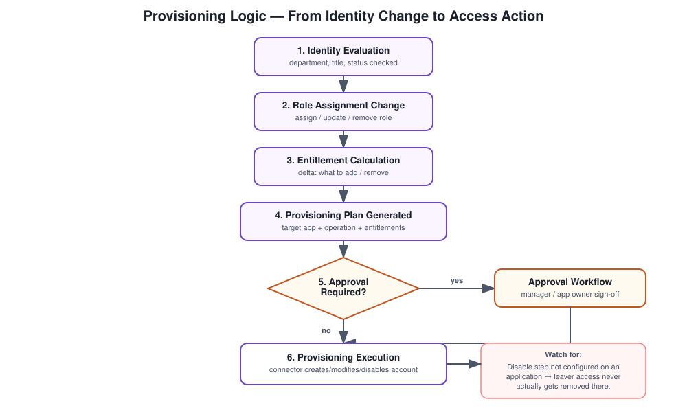

# JML Lifecycle — Provisioning Logic

## What this covers

Once IdentityIQ knows something changed — a joiner, a mover, a leaver — it still has to figure out exactly what to do about it across every connected system. This is that decision-making layer: how an identity change turns into a concrete create/modify/disable action on an actual account.

## The scenario

An organization wants access across AD, ERP, email, and whatever else is connected to update automatically whenever someone joins, changes role, or leaves — without someone manually working out what needs to change where.

## How I think about the logic

It comes down to identity attributes (department, title, status) feeding into RBAC, which feeds into provisioning policies, which get triggered by lifecycle events. The short version: identity change leads to role change leads to provisioning action. Each step is a fairly mechanical translation of the one before it, which is exactly what makes it automatable.

## Concepts

Provisioning plans, provisioning policies, RBAC, entitlements, application connectors, approval/execution workflows, the identity cube, and the account operations themselves (create, modify, disable).

## Step by step

**Step 1 — Identity evaluation.** IdentityIQ looks at department, title, and status to figure out which roles should apply.

**Step 2 — Role assignment change.** Roles get assigned on a joiner, updated on a mover, removed on a leaver. Roles are really the bridge between "who this person is" and "what they can access."

**Step 3 — Entitlement calculation.** Each role carries a set of entitlements, and IdentityIQ works out the delta — what needs to be added, what needs to be removed.

**Step 4 — Provisioning plan generation.** This is the actual instruction set: target application, account operation (create/modify/disable), and the entitlements to add or remove.

**Step 5 — Policy and approval check.** If the change requires approval, it routes through a workflow to a manager or app owner. If it's auto-approved by policy, it goes straight to execution.

**Step 6 — Provisioning execution.** The provisioning engine sends the actual request to the target system through its connector and the account gets created, modified, or disabled.

## Where this goes wrong

Leaver risk is the one I'd flag first — if the leaver event never fires, or the disable logic isn't actually configured on a given application, accounts stay active well past when they should. Beyond that, the usual suspects: connector misconfiguration, target systems that are unreachable when provisioning tries to run, and policy settings that don't match what the business actually intended.

## Interview answer

"Provisioning in IdentityIQ is role-driven. An identity attribute change leads to a role change, which generates a provisioning plan describing exactly what needs to happen across target systems. The provisioning engine executes that plan through connectors, optionally routing through an approval workflow first."

## Why it matters beyond the mechanics

Automated provisioning is the difference between an IAM program that's actually enforcing least privilege and one that's just documenting access after the fact. The logic described here is what makes that enforcement real instead of aspirational.
