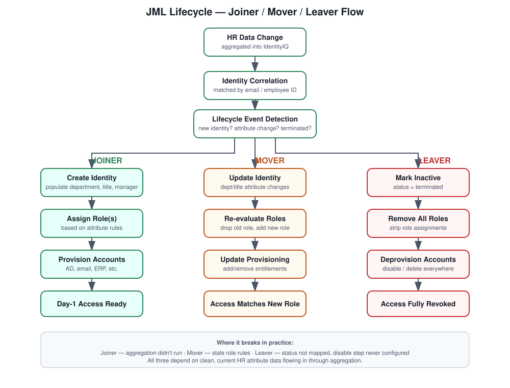

# IdentityIQ JML Lifecycle

## What this folder is about

Joiner-Mover-Leaver is, in my opinion, the single most important thing an IAM platform does. New employees show up, people change roles or departments, and people leave — and if any of those three events doesn't get handled cleanly, you end up with either a frustrated new hire who can't log in on day one, or a former employee whose account is still active six months after they walked out the door. Neither is a good look.

## The business problem

Handled manually, JML breaks down in predictable ways: onboarding takes days instead of hours, role changes leave people with both their old and new access stacked on top of each other, and offboarding depends on someone remembering to file a ticket.

## How I approach it

The HR system is the authoritative source — everything else follows from that. IdentityIQ picks up changes from HR, evaluates identity attributes (department, title, employment status), and uses RBAC to figure out what access should look like. Provisioning workflows then make that real across target systems.

1. Detect changes coming out of HR.
2. Trigger the appropriate lifecycle event.
3. Assign or remove access automatically based on role rules.
4. Keep an audit trail of all of it for compliance.

## Concepts that matter here

Identity lifecycle management, authoritative sources, identity attributes, RBAC, lifecycle events (joiner/mover/leaver), provisioning policies, workflows, and access revocation.

## The three flows, briefly

**Joiner** — new hire shows up in HR, gets aggregated into IdentityIQ, gets identity attributes populated, gets a role assigned by business rule, and provisioning creates their accounts automatically.

**Mover** — HR reflects a department or title change, IdentityIQ updates the identity, drops the old role, assigns the new one, and access updates across every connected system.

**Leaver** — HR marks someone terminated, IdentityIQ flags the identity inactive, every role gets pulled, and access gets revoked everywhere it exists.

## What's in this folder

- `Business-Scenario.md` — the actual enterprise problem this solves, in more detail
- `Lifecycle-Flow.md` — the execution flow from HR data to provisioned access
- `Provisioning-Logic.md` — how IdentityIQ decides what to provision and how
- `Identity-Attributes.md` — the attributes that drive every decision in this whole process
- `Common-Issues.md` — what actually goes wrong, and how I've fixed it

## Where it tends to fail

Identity not getting created at all (usually an aggregation or authoritative-source config issue), roles not updating on a department change (attribute mapping or stale rules), provisioning silently failing (connectivity), and — the one that should worry every security team — access not getting revoked on termination because the leaver event never actually fired.

## If asked to explain JML in an interview

"JML in IdentityIQ runs off an authoritative HR source. When someone joins, moves, or leaves, IdentityIQ picks that up through aggregation, evaluates their attributes, adjusts roles accordingly, and provisions or deprovisions access automatically across whatever systems are connected. The whole thing is designed so IT isn't the bottleneck and access doesn't linger past when it should."
