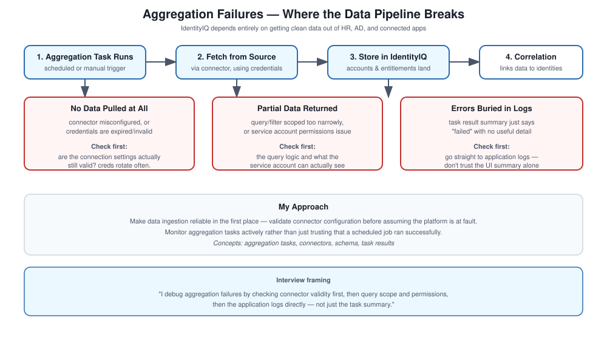

# Aggregation Failures

## What this is about

IdentityIQ depends entirely on getting clean data out of HR, AD, and whatever databases or apps it's connected to. When aggregation fails, identities stop getting created or updated, and access decisions downstream start running on stale information without anyone necessarily noticing right away.

## My approach

Make sure data ingestion is reliable in the first place, validate connector configuration before assuming the platform itself is at fault, and actually monitor aggregation tasks rather than just trusting that scheduled jobs ran successfully.

## Concepts

Aggregation tasks, connectors, schema, task results.

## How aggregation is supposed to flow

1. The aggregation task runs.
2. Accounts and entitlements get fetched from the source.
3. Data gets stored in IdentityIQ.
4. Correlation runs to link that data to identities.

## What actually goes wrong

**No data pulled at all** — usually a connector misconfiguration or bad credentials. First thing I check is whether the connection settings are actually still valid; credentials expire or rotate more often than people remember to update IdentityIQ's copy of them.

**Partial data** — usually a query or filter issue, or a permissions problem on the service account that's only able to see a subset of what it should. I'd check the query logic and the access rights of whatever account is running the aggregation.

**Errors showing up in the logs** — I'd go through the application logs directly rather than relying on the task result summary, since the summary often just says "failed" without the detail you actually need.

## Interview talking points

How I'd debug an aggregation failure, why connectors matter as much as they do, and how I think about validating data quality rather than just confirming a task ran without erroring.
