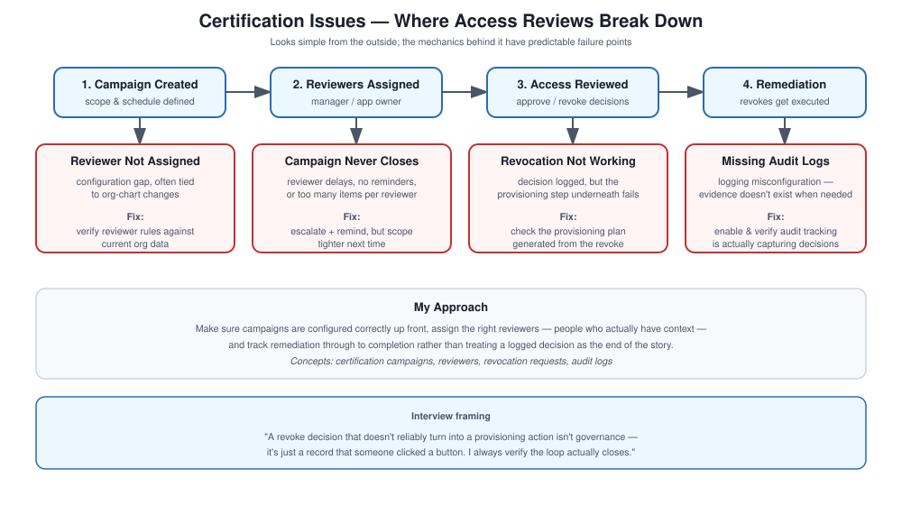

# Certification Issues

## What this covers

Access reviews look simple from the outside — a manager looks at access, approves or revokes it — but the mechanics behind getting that to actually work reliably have a handful of common failure points worth knowing well.

## The scenario

Organizations run access reviews regularly: managers go through their team's access and approve or revoke it. When this process breaks down, it's not just an inconvenience — it directly threatens compliance.

## My approach

Make sure campaigns are configured correctly in the first place, assign the right reviewers, and actually track remediation through to completion rather than treating a logged decision as the end of the story.

## Concepts

Certification campaigns, reviewers, revocation requests, audit logs.

## How a campaign is supposed to flow

1. Campaign gets created.
2. Reviewers get assigned.
3. Access gets reviewed.
4. Decisions get made.
5. Remediation gets executed.

## What I've seen go wrong

**Reviewer not assigned** — usually a configuration issue, often tied to org-chart changes that the reviewer rules haven't caught up with. Fix is to verify the reviewer assignment rules against current org data.

**Campaign never completing** — typically reviewer delays. Fix is sending reminders and escalating, but the better long-term fix is scoping campaigns so reviewers can realistically finish on time.

**Revocation not actually working** — usually a provisioning issue underneath the certification layer. Fix is checking the provisioning plan that should have been generated from the revoke decision.

**Missing audit logs** — usually a logging misconfiguration. Fix is enabling audit tracking properly and verifying it's actually capturing what it should.

## Interview talking points

How the certification lifecycle actually works end to end, what makes reviewers struggle in practice, and why compliance teams care about this as much as they do.
