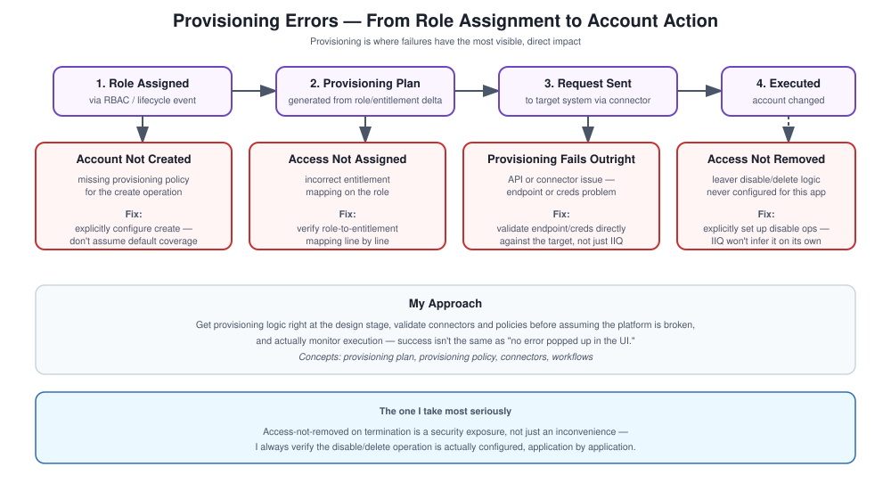

# Provisioning Errors

## What this covers

Provisioning is the part of IdentityIQ that actually creates, updates, or removes access — which means it's also where failures have the most direct, visible impact: a new hire who can't log in, or worse, an account that should have been disabled but wasn't.

## My approach

Get the provisioning logic right at the design stage, validate connectors and policies before assuming the platform's broken, and actually monitor execution rather than assuming success just because no error popped up in the UI.

## Concepts

Provisioning plan, provisioning policy, connectors, workflows.

## How it's supposed to flow

1. A role gets assigned.
2. A provisioning plan gets generated from it.
3. A request goes out to the target system.
4. The action gets executed.

## What goes wrong, and what I'd check

**Account not created** — usually a missing provisioning policy for the create operation on that application. Fix is configuring the create operation explicitly rather than assuming it's covered by default.

**Access not actually assigned** — usually incorrect entitlement mapping. Fix is verifying the role-to-entitlement mapping line by line, not just spot-checking it.

**Provisioning failing outright** — usually an API or connector issue. Fix is validating the endpoint and credentials directly against the target system, not just inside IdentityIQ's config screen.

**Access not removed (this is the one I take seriously)** — usually leaver logic that was never configured for a given application. Fix is making sure disable or delete operations are explicitly set up, because IdentityIQ won't infer that on its own.

## Interview talking points

What a provisioning plan actually is and why it matters, the most common ways provisioning fails in practice, and how I'd debug a failure methodically instead of just retrying and hoping.
