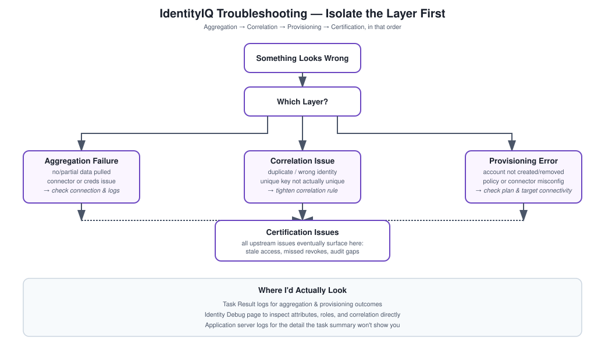

# IdentityIQ Troubleshooting

## What this folder is

If JML and onboarding are about building the system, this is about keeping it running. In any real implementation, data flows continuously between HR, IdentityIQ, and a dozen target systems, and failures happen — bad data, configuration drift, an integration that quietly stopped working three weeks ago and nobody noticed until a certification campaign turned up stale access.

## My general approach

I work through this in layers rather than guessing: figure out which area the problem is actually in (aggregation, correlation, provisioning, or certification), validate the source data, check IdentityIQ's own configuration, dig through logs and task results, and then fix and reprocess. The mental model I keep coming back to is that almost every issue is data, logic, or integration — rarely something genuinely mysterious in the platform itself.

## Concepts that show up everywhere

Aggregation tasks, the identity cube, correlation rules, provisioning plans, certification campaigns, application logs, and task results.

## The general flow I follow

1. Identify what kind of issue this looks like.
2. Check the HR or source data feeding the problem.
3. Verify aggregation actually completed and pulled what it should have.
4. Validate identity attributes look right.
5. Check role assignment logic.
6. Review the provisioning plan if access is involved.
7. Go through logs.
8. Fix the root cause and re-run.

## The three areas this folder covers

**Aggregation failures** — problems pulling data in from source systems in the first place.

**Provisioning errors** — problems creating, modifying, or removing accounts once a decision's already been made.

**Certification issues** — problems in the access review and remediation cycle itself.

## Common patterns across all of them

Aggregation not pulling data, identity correlation matching the wrong (or no) identity, provisioning failing silently, revocations not actually getting enforced, and certification campaigns dragging past deadline.

## Interview answer

"I troubleshoot IAM issues by isolating whether the problem sits in aggregation, correlation, provisioning, or certification first. From there I validate the source data, check configuration, and work through logs to find the actual root cause rather than guessing at a fix."
