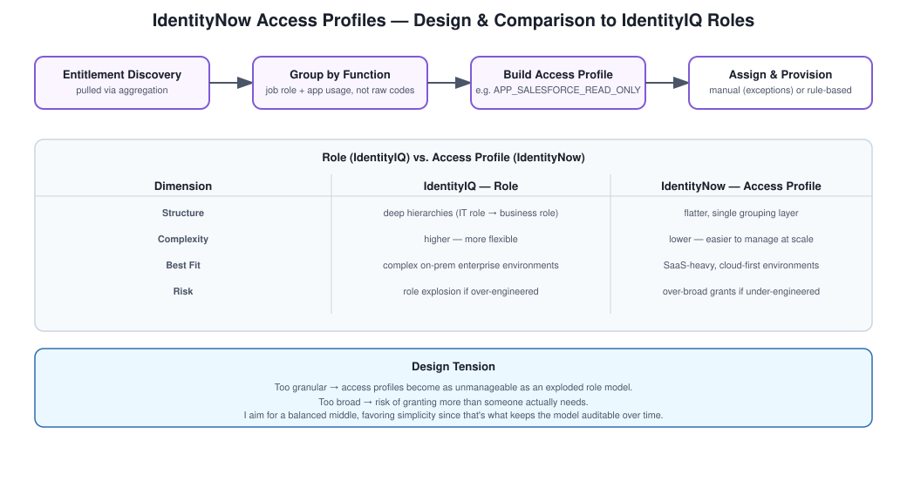

# Role vs. Access Profile

## Why this comparison matters

People moving between IdentityIQ and IdentityNow often assume "role" and "access profile" are just two names for the same thing. They're related concepts, but the platforms make genuinely different design choices, and being able to articulate that difference clearly is a fairly common interview question.

## How I'd frame it

IdentityIQ leans toward full RBAC with deeper role hierarchies, built for complex enterprise environments where you need that flexibility. IdentityNow leans toward a simplified access model better suited to SaaS-heavy, cloud-first environments where you want something lighter-weight and faster to manage.

## Side by side

| | IdentityIQ | IdentityNow |
|---|---|---|
| Access model | Roles | Access Profiles |
| Complexity | Higher | Lower |
| Best fit | Enterprise RBAC, complex on-prem environments | Cloud/SaaS IAM |

## Interview answer

"IdentityNow simplifies RBAC by using access profiles instead of deeper role hierarchies. It's not that one approach is strictly better — IdentityIQ's role model gives you more flexibility for complex enterprise environments, while IdentityNow's access profiles are a better fit when you're managing a SaaS-heavy environment and want something lighter to maintain."

## Takeaway

Cloud IAM generally favors simplicity over flexibility, which is a deliberate trade-off, not a limitation. Knowing when that trade-off makes sense — and when it doesn't — is part of what an architect actually gets paid to decide.
