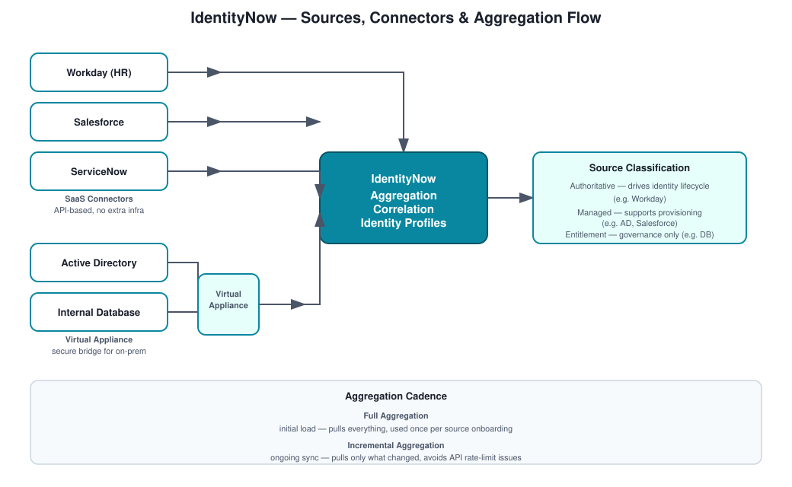

# IdentityNow – Aggregation Flow

## The scenario

An enterprise running Workday, AD, and Salesforce independently — each one creating and managing user accounts on its own terms. IdentityNow needs to pull all of that together into a single, current picture of who has what.

## Approach

Aggregation jobs pull data from each configured source. The pattern is always the same regardless of source type: source data flows in, gets aggregated, gets correlated to an identity, and only then becomes something governance can actually act on.

## Concepts

Sources, full vs. incremental aggregation, identity profiles, correlation rules, account attributes, entitlements.

## Step by step

**Source configuration** — the source (AD, Workday, whatever) gets configured and connector authentication gets established.

**Aggregation trigger** — runs scheduled or manually, full or incremental depending on the situation.

**Data retrieval** — the connector fetches accounts, attributes (email, username), and entitlements (groups, roles).

**Data storage** — the data lands in IdentityNow, where accounts can exist on their own before they're correlated to an identity.

**Identity correlation** — accounts get matched to identities using email or employee ID.

**Identity profile assignment** — identity profiles take over from there, defining attribute mapping and lifecycle state.

## Full vs. incremental

Full aggregation pulls everything and is mainly used during initial onboarding. Incremental aggregation pulls only what's changed and is what you'd actually run daily once the source is established — running full aggregation constantly on a large source is a fast way to hit API rate limits or just slow everything down for no real benefit.

## What goes wrong

**Missing accounts** — aggregation didn't actually run, or a filter is scoped too narrowly and silently excluding accounts that should be there.

**Duplicate identities** — a correlation rule issue, usually traceable to an identifier that isn't as unique as it was assumed to be.

**Stale data** — incremental sync that isn't actually configured, so the platform's view of the source just slowly drifts out of date.

## Interview answer

"Aggregation in IdentityNow pulls accounts and entitlements from each source and correlates them back to identities through identity profiles. That correlation step is really what turns scattered source data into something governance can actually act on — without it, you just have a pile of disconnected accounts."
