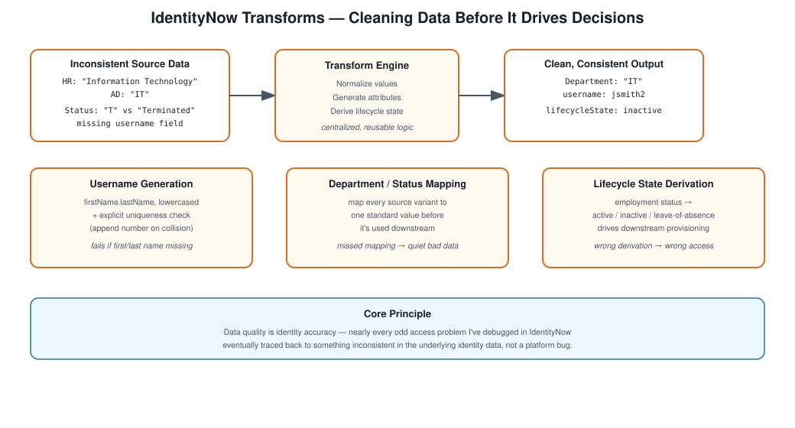

# Transforms (Architect View)

## The scenario

Different source systems describe the same person in different, often inconsistent ways. One system says "IT," another says "Information Technology." A username might be missing entirely from one source and present in another with a different format. None of this is a one-off problem — it's what every multi-source identity environment looks like by default.

## The impact if you don't deal with it

Correlation starts failing because the data it depends on isn't consistent, and access gets assigned incorrectly as a downstream result. Transforms are the tool IdentityNow gives you to clean this up before it causes real damage.

## Core principle

Data quality is identity accuracy. I don't think that's an overstatement — nearly every weird access problem I've debugged in IDN eventually traced back to something inconsistent in the underlying identity data.

## Strategy

**Normalizing data** — mapping department codes and similar fields into consistent values across sources.

**Generating attributes** — deriving things like usernames and email addresses rather than expecting every source to hand them over pre-formatted.

**Deriving lifecycle state** — working out whether someone's active, terminated, or on leave based on employment status, rather than trusting a single raw status field blindly.

## Decisions I'd defend

**Centralizing transform logic** so it's reusable and consistent, instead of rebuilding the same normalization logic separately for every source.

**Keeping transform logic simple** rather than chasing every edge case — there's a real trade-off between flexibility and simplicity, and over-engineered transform chains get genuinely hard to debug six months later.

## Where this fails

Incorrect transform logic that produces wrong identity data nobody notices until it causes a downstream access problem, and missing attributes that quietly break whatever process downstream was depending on them.

## Architect-level answer

"Transforms are how I handle data normalization and attribute generation in IdentityNow. I use them to standardize identity data across sources, make correlation reliable, and support lifecycle automation — and I try to keep the logic simple enough that someone else on the team can actually follow it later."

## Takeaway

Data quality is genuinely foundational here, not a nice-to-have. Transforms are where that quality actually gets enforced, and keeping them simple and reusable pays off every time a new source gets onboarded.

## Files in this folder

- `Username-Logic.md` — generating unique usernames
- `Data-Normalization.md` — standardizing inconsistent source data
- `Transform-Examples.json` — actual transform definitions I've put together, including username generation, email generation, department/status normalization, and lifecycle state derivation
